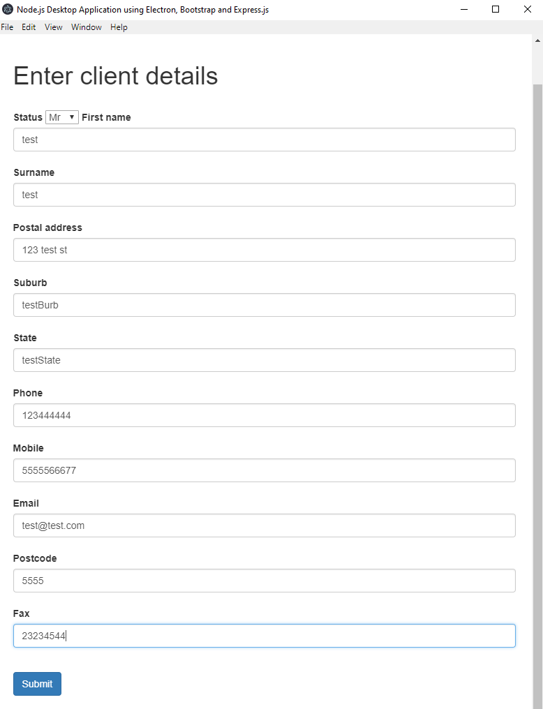

<h2>Desktop Application powered by Node.js, Electron, Bootstrap, and Express.js</h2>

<h3>This is an example use-case of the Node.js Desktop Template</h3>

[Template found here](https://github.com/zero-equals-false/node-desktop-app-template)


This is a Node.js desktop solution for both front-end and back-end, taking data from a form on the front-end and mapping it to specific locations in a word document (data processing). However, *this is only one use-case.* This demonstrates building a modern desktop application. 

[Full tutorial here](https://zeroequalsfalse.com/posts/create-a-node-js-desktop-application-with-electron-bootstrap-and-express)

<br>



<h3>Download</h3>

```
git clone https://github.com/zero-equals-false/node-desktop-application-example.git
```

<h3>Installation</h3>

```
npm install
```

```
npm start
```

<h3>Software</h3>

[Node.js](https://nodejs.org/en/)<br>
[Electron](https://electronjs.org/)<br>
[Bootstrap template](https://github.com/BlackrockDigital/startbootstrap-bare/)<br>
[Express.js](https://expressjs.com/)
[Docxtemplater](https://docxtemplater.com/)

<h3>Benefits</h3>

- Create a desktop application that enables easy integration with third-party software from the web.
It uses node-package-manager - which is the largest software registry in the world.
You can search available integrations on their website here:
[Node Registry](https://www.npmjs.com/)

- Cross-platform and Deployment to the Cloud

- [Desktop-First Design](https://designmodo.com/desktop-first-design-responsive/)

<h3>Done with your app?</h3>

- Create the Desktop executable by [following these instructions](https://electronjs.org/docs/tutorial/application-distribution/)
- Deploy to the Cloud - [AWS](https://aws.amazon.com/getting-started/projects/deploy-nodejs-web-app/)

<h3>Thank you</h3>

Thank you for taking this tutorial - currently taking pull requests for improvements. If you like the template, don't forget to leave a star! Happy coding
